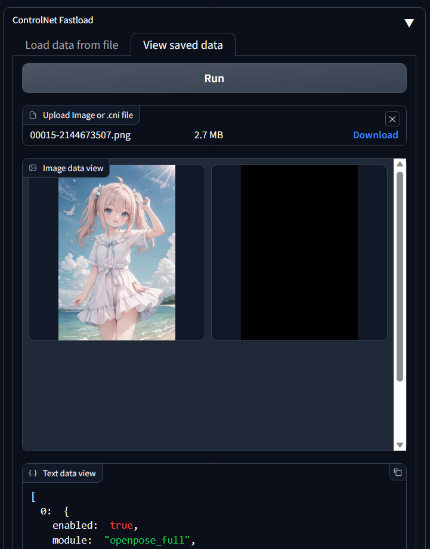

# sd-webui-controlnet-fastload
An extension for `stable-diffusion-webui`.    
[中文文档](README_zh_CN.md)   

## Features
- Can save the parameters of the [Controlnet plugin](https://github.com/Mikubill/sd-webui-controlnet).
- Embed Controlnet parameters directly into the image or save in a separate file for sharing.
- Quickly load parameters from an image or file embedded with Controlnet parameters to txt2img or img2img.
- Use under the UI or call through the API.
- Optional features `isEnabledManualSend` **allow you to complete all preparations under this plugin.**
- `Controlnet Fastload Filter` Tab allow you import pictures according to **ControlNet parameter classification**

## Preview
### Main function

### View embedded information

### Controlnet Fastload Filter tab


## Usage
### UI
Use whatever you want.    
> You can adjust preferences in settings or enable function `isEnabledManualSend`

### Web API

#### Integrating `/sdapi/v1/*2img`

By integrating with `/sdapi/v1/*2img`, you can only get the processed image itself
You should confine `/sdapi/v1/*2img` with `/controlnetFastload/fetch` mentioned below to get the ControlNet data

This is the example to work with `/sdapi/v1/txt2img`:
```json
{
    "prompt": "1girl",
    "batch_size": 1,
    "steps": 20,
    "cfg_scale": 7,
    "alwayson_scripts": {
        "controlnet fastload": {
            "args": [
                {
                    "mode": "Load & Save",
                    "filepath": "D:\\stable-diffusion-webui\\outputs\\txt2img-images\\2023-08-07\\00006-1269320983.cni",
                    "overwritePriority": "ControlNet Plugin First"
                }
            ]
        }
    }
}
```

In `"args"`, pass:
- `mode`: How the extension works, you can pass one of the `Load`, `Save`, `Load & Save`
- `filepath`: The filepath you need to upload
- `overwritePriority`: Determine the priority of the native ControlNet extension and this extension, you can pass one of the `ControlNet Plugin First`, `ControlNet First`

#### Route POST `/controlnetFastload/fetch`

Used to obtain the generated Controlnet data after a certain txt2img and img2img generation, Body of the route accepts a JSON object with the following property:
- `ControlNetID`: An ID to identify a specific txt2img or img2img generation, **see the example below for details**
- `returnType`: Decide whether to return embedded images or separate .cni files, you can pass one of the `Extra .cni file`, `Embed photo`, `Both`
- `extraPicBase64`: [Optional] Pass the base64 of original generate image when returnType is `Embed photo` or `Both`

Here's an example use both `txt2img` and `/controlnetFastload/fetch`
```python
import json
import requests


def txt2img_main():
    # Add the "controlnet fastload" in "alwayson_scripts" to activate the extension.
    json_ = {
        "prompt": "1girl",
        "negative_prompt": "",
        "batch_size": 1,
        "steps": 20,
        "cfg_scale": 7,
        "alwayson_scripts": {
            "controlnet fastload": {
                "args": [
                    {
                        "mode": "Load & Save",
                        "filepath": "D:\\stable-diffusion-webui\outputs\\txt2img-images\\2023-08-07\\00006-1269320983"
                                    ".cni",
                        "overwritePriority": "Plugin first",
                    }
                ]
            }
        }
    }
    response = requests.post(url="http://localhost:1819/sdapi/v1/txt2img", json=json_) # replace with your url
    pic_base64_txt2img = response.json()['images'][0]
    info = json.loads(response.json()['info'])
    # Here we get the ControlNetID corresponding to this time txt2ing, prepare for the next step to extract Controlnet Data
    ControlNetID_txt2img = info['extra_generation_params']['ControlNetID']
    return pic_base64_txt2img, ControlNetID_txt2img


def controlNetFastload_Load(pic_base64_load, ControlNetIDLoad):
    json__ = {
        "ControlNetID": ControlNetIDLoad,
        "returnType": "Extra .cni file",
        "extraPicBase64": pic_base64_load
    }
    response = requests.post(url="http://localhost:1819/controlnetFastload/fetch", json=json__) # replace with your url
    return response.json() # Here returns Controlnet Data encapsulated in Base64


if __name__ == '__main__':
    pic_base64_, ControlNetID_ = txt2img_main()
    print(controlNetFastload_Load(pic_base64_, ControlNetID_))
```

#### Route POST `/controlnetFastload/view`

Used to obtain information in Controlnet Data files, Body of the route accepts a JSON object with the following property:
- `filepath`: The file address of the uploaded file
- `except_type`: The image data format expected to be returned, you can pass one of the `nparray`, `base64`

#### Route GET `/controlnetFastload/version`

Get the current API version

## Controlnet Fastload Filter Tab security settings
Due to security reasons such as remote host access, you can add access restrictions to the Controlnet Fastload Filter tab via set Environment variables

### Environment variables

| Name                                      | Description                                                                                                                                                                                                                                                |
|-------------------------------------------|------------------------------------------------------------------------------------------------------------------------------------------------------------------------------------------------------------------------------------------------------------|
| CONTROLNET_FASTLOAD_FILTER_ACCESS_CONTROL | Determine the level of directory reading by the plugin when remote access is enabled. <br/>0 - Cannot read any directories. <br/>1 - Can only read the specific directories 'txt2img' and 'img2img'. <br/>2 - Can read any directory.<br/>**Default is 2** |
 | CONTROLNET_FASTLOAD_FILTER_ACCESS_TOKEN   | A token with the highest privileges when accessing remotely.                                                                                                                                                                                               |

## Star History

<a href="https://star-history.com/#pk5ls20/sd-webui-controlnet-fastload&Date">
  <picture>
    <source media="(prefers-color-scheme: dark)" srcset="https://api.star-history.com/svg?repos=pk5ls20/sd-webui-controlnet-fastload&type=Date&theme=dark" />
    <source media="(prefers-color-scheme: light)" srcset="https://api.star-history.com/svg?repos=pk5ls20/sd-webui-controlnet-fastload&type=Date" />
    
  </picture>
</a>
